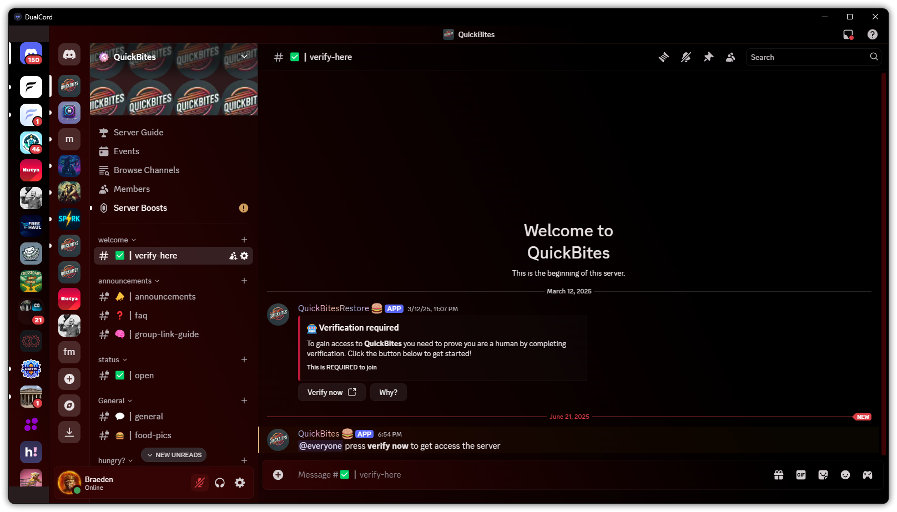

# DualCord

> Use two Discord accounts simultaneously in a single desktop application

[](https://www.electronjs.org/)
[](https://github.com/Braeden90000/Dualcord)
[](LICENSE)

DualCord is a desktop application built with Electron that allows you to use two Discord accounts at the same time with an innovative side-by-side interface. Perfect for managing multiple Discord identities, moderating servers, or separating personal and work accounts.

 <!-- You can add a screenshot later -->

## ✨ Features

- **🎭 Dual Account Support** - Run two Discord accounts simultaneously
- **📊 Side-by-Side Server Lists** - See both accounts' servers in a compact 72px sidebar
- **⚡ Instant Account Switching** - Click any server icon to switch accounts instantly
- **🧠 Smart Channel Memory** - Remembers your last visited channel for each server
- **🔗 Enhanced Link Handling** 
  - Normal click: Copy link to clipboard
  - Shift+click: Open link in default browser (Not Working)
- **🖼️ Full Discord Functionality** - Image previews, reactions, voice chat, and more
- **🚫 No Console Window** - Clean launch with VBS script
- **🛡️ App Detection Bypass** - Blocks "Open in App" prompts

## 📋 Requirements

- Windows 10 or later
- [Node.js](https://nodejs.org/) v14 or higher
- Discord accounts with tokens (see [Token Setup](#-token-setup))

## 🚀 Quick Start

### Option 1: One-Click Setup (Recommended)

1. **Download** the latest release or clone this repository
2. **Double-click** `DualCord.vbs` to launch
   - First run will automatically install dependencies
   - If tokens aren't configured, it will prompt you to add them

### Option 2: Manual Setup

```bash
# Clone the repository
git clone https://github.com/Braeden90000/Dualcord.git
cd Dualcord

# Install dependencies
npm install

# Configure your tokens (see Token Setup below)

# Start the application
npm start
```

### Option 3: Create Desktop Shortcut

Run `Create Desktop Shortcut.bat` to add DualCord to your desktop with a custom icon.

## 🔑 Token Setup

### Getting Your Discord Tokens

> ⚠️ **Security Warning**: Discord tokens provide full access to your account. Never share them with anyone!

1. **Open Discord in your web browser** (Chrome, Firefox, etc.)
2. **Press F12** to open Developer Tools
3. **Go to the Application tab** (Chrome) or Storage tab (Firefox)
4. **Navigate to** Local Storage → https://discord.com
5. **Find the "token" entry** and copy the value (without quotes)
6. **Repeat in an incognito/private window** for your second account

### Adding Tokens to DualCord

1. **Open `index.html`** in any text editor
2. **Find the token section** (around line 123-124):
   ```javascript
   const DISCORD_TOKEN_1 = 'DISCORD_TOKEN_1';
   const DISCORD_TOKEN_2 = 'DISCORD_TOKEN_2';
   ```
3. **Replace the placeholders** with your actual tokens:
   ```javascript
   const DISCORD_TOKEN_1 = 'your-first-token-here';
   const DISCORD_TOKEN_2 = 'your-second-token-here';
   ```
4. **Save the file** and launch DualCord

## 🖱️ Usage Guide

### Interface Layout

```
┌─────────┬────────────────────────────┐
│ Server  │                            │
│ Icons   │    Active Discord Account  │
│ (72px)  │                            │
│         │    Full Discord Interface  │
│ Both    │                            │
│Accounts │                            │
└─────────┴────────────────────────────┘
```

### Controls

- **Click any server icon** - Switch to that account and open that server
- **Click home button** - Switch to that account's DMs
- **Click on links in chat**:
  - **Normal click** - Copy link to clipboard
  - **Shift+click** - Open link in browser
- **All Discord features work normally** - Voice, video, screen share, etc.

### Account Switching Behavior

1. Initially shows Account 2's server list with Account 1's main view
2. Clicking a server from either account:
   - Switches the sidebar to show the other account
   - Shows the clicked account's Discord interface
   - Navigates to the clicked server
   - Remembers your current channel for when you return

## 🛠️ Troubleshooting

### Common Issues

| Issue | Solution |
|-------|----------|
| "Node.js is not installed" | Download and install from [nodejs.org](https://nodejs.org/) |
| "Tokens not configured" | Add your Discord tokens to index.html (see Token Setup) |
| App shows Electron icon | Run `Create Desktop Shortcut.bat` for proper icon |
| "Discord app detected" popup | Should be automatically blocked, close if it appears |
| Links don't copy/open | Make sure you're clicking directly on the link text |
| Lost in wrong channel | The app remembers channels per server, per account |

### Advanced Troubleshooting

1. **Clear app data**: Delete the folders in `%APPDATA%/dualcord/`
2. **Reset tokens**: Re-add tokens if Discord logged you out
3. **Update Electron**: Run `npm update electron`

## 🔒 Security & Privacy

### What DualCord Does
- ✅ Stores tokens only in your local index.html file
- ✅ Uses separate browser sessions for each account
- ✅ Runs entirely on your computer
- ✅ Open source for transparency

### What DualCord Does NOT Do
- ❌ Send tokens to any server
- ❌ Store data online
- ❌ Modify Discord's servers
- ❌ Collect analytics or telemetry

### Security Best Practices
- Keep your tokens private
- Don't commit index.html with tokens to public repos
- Use strong, unique passwords for your Discord accounts
- Enable 2FA on both Discord accounts

## 📁 Project Structure

```
dualcord/
├── index.html              # Main application interface
├── main.js                 # Electron main process
├── simple-preload.js       # Token injection script
├── package.json            # Project configuration
├── DualCord.vbs           # Silent launcher (no console)
├── Create Desktop Shortcut.bat  # Desktop shortcut creator
├── icon.ico               # Application icon
├── README.md              # User documentation (this file)
└── CLAUDE.md              # Technical documentation
```

## 🔧 Configuration

### Window Size
Edit `main.js` to change the default window size:
```javascript
width: 1600,  // Change width
height: 900,  // Change height
```

### Sidebar Width
Edit `index.html` to adjust the server list width:
```css
.sidebar {
    width: 72px;  /* Change to desired width */
}
```

## 🤝 Contributing

Contributions are welcome! Please feel free to submit a Pull Request. For major changes:

1. Fork the repository
2. Create your feature branch (`git checkout -b feature/AmazingFeature`)
3. Commit your changes (`git commit -m 'Add some AmazingFeature'`)
4. Push to the branch (`git push origin feature/AmazingFeature`)
5. Open a Pull Request

## 📝 License

This project is licensed under the MIT License - see the [LICENSE](LICENSE) file for details.

## ⚠️ Disclaimer

This application is not affiliated with, endorsed by, or connected to Discord Inc. Use of this application may violate Discord's Terms of Service. Users assume all risks associated with using this tool. The developers are not responsible for any consequences that may arise from its use, including but not limited to account suspension or termination.

## 🙏 Acknowledgments

- Built with [Electron](https://www.electronjs.org/)
- Inspired by the need for better multi-account Discord management
- Thanks to all contributors and users

## 📞 Support

- **Issues**: [GitHub Issues](https://github.com/Braeden90000/Dualcord/issues)
- **Discussions**: [GitHub Discussions](https://github.com/Braeden90000/Dualcord/discussions)
- **Wiki**: [GitHub Wiki](https://github.com/Braeden90000/Dualcord/wiki)

---

<p align="center">Made with ❤️ for the Discord community</p>
<p align="center">⭐ Star this repo if you find it useful!</p>